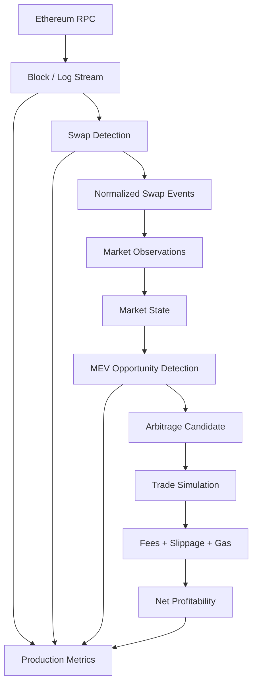

# On-Chain MEV Engine

A research-oriented Ethereum MEV engine built from first principles.

The project progressively evolves from AMM mathematics and arbitrage simulation into a real-time blockchain data pipeline capable of detecting swaps, maintaining market state, and identifying cross-pool MEV opportunities.

The overall progression is:

```text
AMM Mathematics
      ↓
Arbitrage Simulation
      ↓
Real Ethereum Data
      ↓
Real Uniswap State
      ↓
Uniswap V3 Concentrated Liquidity
      ↓
Cross-Pool Arbitrage
      ↓
MEV Detection
      ↓
Production Architecture
      ↓
Real-Time Block Processing
      ↓
MEV Opportunity Detection
```

---

# Architecture

The current system follows a layered architecture:



The real-time data flow is:

```text
Ethereum
   │
   ▼
Block Stream
   │
   ▼
Swap Detection
   │
   ▼
Normalized Swap Events
   │
   ▼
Market Observations
   │
   ▼
Market State
   │
   ▼
Opportunity Detection
   │
   ▼
Arbitrage Simulation
   │
   ▼
Profitability Analysis
```

The project currently stops at **research and opportunity detection**. It does not submit live trades.

---

# Current Progress

## Milestone 1 — AMM & Arbitrage

Built a constant-product AMM using:

```text
x × y = k
```

Implemented:

* AMM reserves
* Spot price
* Trading fees
* Swap calculations
* Pool state updates
* Arbitrage simulation
* Arbitrage PnL
* Trade-size optimization
* Unit tests

The engine can simulate arbitrage between two AMMs and determine whether a trade is profitable.

---

# Milestone 2 — Ethereum Connectivity

Connected the engine to a real Ethereum RPC.

Implemented:

* Ethereum RPC client
* Latest block retrieval
* Block inspection
* Transaction retrieval
* Transaction receipts
* Event logs
* ERC-20 Transfer decoding
* Token decimal conversion
* Gas information

The engine can now work with real Ethereum blockchain data instead of relying only on simulated data.

---

# Milestone 3 — Real Uniswap State

Connected directly to Uniswap contracts on Ethereum.

## Uniswap V2

Implemented:

* Factory lookup
* Pair discovery
* Token identification
* Real reserves
* Spot price calculation
* Real pool state
* Swap simulation using real reserves

## Uniswap V3

Connected to the WETH/USDC 0.05% pool:

```text
0x88e6A0c2dDD26FEEb64F039a2c41296FcB3f5640
```

Implemented retrieval of:

* `slot0`
* `sqrtPriceX96`
* Current tick
* Active liquidity
* Pool fee
* Tick spacing
* Tick bitmap
* Tick information

---

# Milestone 4 — Uniswap V3 Swap Engine

Unlike Uniswap V2, Uniswap V3 uses concentrated liquidity.

Liquidity is distributed across discrete price ranges rather than across one global constant-product curve.

The V3 swap engine therefore models:

```text
Current Price
      ↓
Active Liquidity
      ↓
Calculate Next Price
      ↓
Find Next Initialized Tick
      ↓
Cross Tick
      ↓
Update Liquidity
      ↓
Continue Swap
      ↓
Final Amount Out
```

Implemented and tested:

* Q96 fixed-point mathematics
* Amount0 calculations
* Amount1 calculations
* Swap-step mathematics
* Tick traversal
* Tick crossing
* Tick bitmap positioning
* Liquidity updates
* Exact-input swap calculations

---

# Milestone 5 — Cross-Pool Arbitrage

Connected real pool state to arbitrage simulation.

The engine can model:

```text
Uniswap V2
     │
     │ Buy
     ▼
   Asset
     │
     │ Sell
     ▼
Uniswap V3
```

and the reverse direction:

```text
Uniswap V3
     │
     │ Buy
     ▼
   Asset
     │
     │ Sell
     ▼
Uniswap V2
```

Implemented:

* Real V2/V3 pool comparison
* Cross-pool arbitrage
* Trade-size optimization
* Slippage
* Trading fees
* Gas-cost modelling
* Net profitability calculations

The important distinction is:

```text
Price Difference
      ↓
Trade Simulation
      ↓
Fees
      ↓
Slippage
      ↓
Gas
      ↓
Net Profit
```

A price discrepancy by itself is not necessarily a profitable arbitrage opportunity.

---

# Milestone 6 — MEV Detection

Introduced event-level MEV detection.

Implemented:

* Ethereum block analysis
* Transaction receipt processing
* Uniswap V2 swap detection
* Uniswap V3 swap detection
* DEX identification
* Pool metadata
* Swap event normalization
* Transaction ordering
* Log ordering
* Unknown-pool filtering
* Non-swap event filtering

The detection architecture is:

```text
Ethereum Receipt
       ↓
Ethereum Logs
       ↓
Event Topic
       ↓
Pool Metadata
       ↓
V2 / V3 Decoder
       ↓
Normalized SwapEvent
```

---

# Milestone 7 — MEV Simulation

Extended the engine toward transaction-level MEV modelling.

Implemented infrastructure for:

* Transaction ordering
* Multi-transaction state simulation
* Front-run / back-run modelling
* Sandwich-style analysis
* Gas-aware profitability
* Execution simulation

The goal is to understand how transaction ordering can change the state of an AMM and therefore create or destroy MEV opportunities.

---

# Milestone 8 — Production Architecture

Introduced production-oriented infrastructure around the MEV engine.

Implemented:

* Persistent market state
* Production block processing
* Opportunity queue
* Async processing
* Processing metrics
* Latency measurement
* Failure tracking
* Queue monitoring
* Block-state persistence

The production architecture is:

```text
Ethereum
    ↓
Block Processor
    ↓
Swap Detection
    ↓
Market State
    ↓
Opportunity Queue
    ↓
Metrics / Monitoring
```

A production-engine demonstration processes real Ethereum blocks and records operational metrics.

---

# Milestone 9 — Real-Time Block Processing

Introduced continuous real-time blockchain processing.

Implemented:

* Ethereum block streaming
* New-block detection
* Block progression validation
* Confirmation handling
* Polling
* Real-time swap detection
* Market observation generation
* Real-time metrics

The real-time pipeline is:

```text
Latest Ethereum Block
        ↓
Block Stream
        ↓
New Block
        ↓
Block Processing
        ↓
Swap Detection
        ↓
Market Observations
```

The engine can now process newly produced Ethereum blocks instead of only analyzing historical blocks manually.

---

# Milestone 10 — MEV Opportunity Detection

Introduced the opportunity-detection layer on top of the real-time market pipeline.

The architecture is now:

```text
Ethereum
   ↓
Block Stream
   ↓
Swap Detection
   ↓
Normalized Swap Events
   ↓
Market Observations
   ↓
Opportunity Detection
   ↓
Arbitrage Opportunities
```

The opportunity engine compares market observations from different liquidity pools.

For example:

```text
                 USDC / WETH
                     │
          ┌──────────┴──────────┐
          │                     │
          ▼                     ▼
     Uniswap V2            Uniswap V3
     Buy Pool              Sell Pool
          │                     │
          ▼                     ▼
      0.000520             0.000525
          │                     │
          └──────────┬──────────┘
                     ▼
               Price Spread
                     │
                     ▼
            MEV Opportunity
```

The detection layer calculates:

* Buy price
* Sell price
* Absolute spread
* Spread percentage
* Gross price difference
* Candidate arbitrage direction

The current implementation deliberately separates **opportunity detection** from **execution**.

---

# Real-Time Pipeline

The complete current pipeline is:

```mermaid
flowchart LR
    A[Ethereum RPC] --> B[Block Stream]
    B --> C[Block Scanner]
    C --> D[Transaction Receipts]
    D --> E[Swap Detector]
    E --> F[Normalized Swap Events]
    F --> G[Market Observations]
    G --> H[Opportunity Detector]
    H --> I[Arbitrage Candidate]
    I --> J[Simulation]
    J --> K[Profitability]
```



This separation allows each component to be tested independently.

---

# Current Live Pipeline

The real-time engine can be launched with:

```powershell
python -m research.realtime_engine
```

A successful run currently produces output similar to:

```text
ON-CHAIN MEV ENGINE — REAL-TIME MEV PIPELINE

Starting block:  25807451
Maximum blocks:  1
Confirmations:   0
Poll interval:   1.0s
Min spread:      0.1%

Pipeline:
Ethereum logs
      ↓
Swap detection
      ↓
Market observations
      ↓
MEV opportunity detection

Block: 25807451
Swaps detected: 1
Market observations: 1
MEV opportunities:   0
```

A zero-opportunity result is valid.

It means that the observed market state did not satisfy the configured opportunity criteria.

---

# Opportunity Detection Example

The opportunity detection layer can compare two observations such as:

```text
Pair:
USDC / WETH

Buy Pool:
Uniswap V2

Sell Pool:
Uniswap V3

Buy Price:
0.000520000000

Sell Price:
0.000525000000

Spread:
0.000005000000

Spread:
0.9615%
```

The engine identifies this as a candidate cross-pool arbitrage opportunity.

However, the opportunity still needs to pass execution analysis:

```text
Detected Spread
      ↓
Trade Size
      ↓
AMM Price Impact
      ↓
DEX Fees
      ↓
Slippage
      ↓
Gas
      ↓
Execution Constraints
      ↓
Net Profit
```

Therefore:

```text
Detected Opportunity ≠ Guaranteed Profit
```

---

# Project Structure

```text
onchain-mev-engine/
│
├── docs/
│   └── amm.md
│
├── research/
│   ├── amm_experiments.py
│   ├── arbitrage_experiment.py
│   ├── ethereum_experiment.py
│   ├── transaction_experiment.py
│   ├── uniswap_experiment.py
│   ├── real_amm_experiment.py
│   ├── uniswap_v3_experiment.py
│   ├── v3_state.py
│   ├── cross_pool_arbitrage.py
│   ├── production_engine.py
│   ├── realtime_engine.py
│   └── opportunity_engine.py
│
├── src/
│   │
│   ├── amm/
│   │   ├── pool.py
│   │   ├── math.py
│   │   ├── arbitrage.py
│   │   ├── optimizer.py
│   │   └── simulator.py
│   │
│   ├── blockchain/
│   │   ├── client.py
│   │   ├── events.py
│   │   ├── swap_detection.py
│   │   ├── uniswap_v2.py
│   │   └── uniswap_v3.py
│   │
│   ├── mev/
│   │   ├── block_scanner.py
│   │   └── block_stream.py
│   │
│   └── mev_detection.py
│
├── tests/
│   ├── test_arbitrage.py
│   ├── test_block_scanner.py
│   ├── test_block_stream.py
│   ├── test_execution.py
│   ├── test_mev_detection.py
│   ├── test_pool.py
│   ├── test_production.py
│   ├── test_slippage.py
│   │
│   └── test_v3/
│       ├── test_math.py
│       ├── test_pool.py
│       ├── test_swap.py
│       └── test_tick_state.py
│
├── pyproject.toml
├── README.md
└── .env
```

---

# Important Components

## Ethereum Client

`src/blockchain/client.py`

Provides the low-level Ethereum RPC interface.

Responsibilities include:

* Block retrieval
* Transaction retrieval
* Transaction receipts
* Event logs
* Gas price
* Transaction counts
* Block receipt processing

The client intentionally contains no MEV-specific logic.

```text
RPC
 ↓
EthereumClient
 ↓
Raw Blockchain Data
```

---

## Swap Detector

`src/blockchain/swap_detection.py`

Converts raw Ethereum logs into normalized swap events.

Supported protocols:

```text
Uniswap V2
Uniswap V3
```

The detector uses registered pool metadata rather than trying to infer arbitrary DEX behaviour from calldata.

---

## Block Scanner

`src/mev/block_scanner.py`

Scans Ethereum blocks and processes transaction receipts.

```text
Block
 ↓
Transactions
 ↓
Receipts
 ↓
Swap Detection
 ↓
Ordered Swap Events
```

It supports both individual blocks and inclusive block ranges.

---

## Block Stream

`src/mev/block_stream.py`

Provides real-time block processing.

```text
Ethereum
   ↓
Latest Block
   ↓
New Block Detection
   ↓
Block Processing
   ↓
Downstream Pipeline
```

It also validates block progression and confirmation requirements.

---

## Opportunity Detection

The opportunity detection layer consumes normalized market observations.

```text
Market Observation A
          +
Market Observation B
          ↓
     Pair Matching
          ↓
   Price Comparison
          ↓
     Spread Check
          ↓
MEV Opportunity
```

This separation allows the opportunity detector to operate independently from Ethereum RPC infrastructure.

---

# Testing

Run the complete test suite:

```powershell
python -m pytest -vv
```

The current test suite contains **51 tests** covering:

* AMM calculations
* Swap behaviour
* Arbitrage
* Arbitrage optimization
* Execution profitability
* Gas calculations
* Slippage
* Ethereum block scanning
* Block streaming
* Production architecture
* Market-state persistence
* Opportunity queue
* MEV detection
* Uniswap V3 mathematics
* Uniswap V3 pool simulation
* Uniswap V3 swap logic
* Tick state
* Tick bitmap calculations

Current status:

```text
51 passed
```

---

# Running the Project

## Run all tests

```powershell
python -m pytest -vv
```

---

## Run opportunity detection

```powershell
python -m research.opportunity_engine
```

This demonstrates cross-pool MEV opportunity detection using normalized market observations.

---

## Run the real-time engine

```powershell
python -m research.realtime_engine
```

This connects the real-time block stream to swap detection, market observations, and opportunity detection.

---

## Run the production engine

```powershell
python -m research.production_engine
```

This demonstrates production-style block processing, persistent market state, queue handling, and metrics.

---

# Configuration

Create a `.env` file in the project root:

```text
ETH_RPC_URL=YOUR_ETHEREUM_RPC_URL
```

The Ethereum client loads the RPC endpoint using `python-dotenv`.

Do not commit private API keys or credentials.

---

# Design Philosophy

The project intentionally avoids jumping directly to a black-box MEV bot.

Each layer is implemented and tested independently:

```text
Mathematics
     ↓
Simulation
     ↓
Unit Testing
     ↓
Blockchain Connectivity
     ↓
Real Protocol State
     ↓
Event Detection
     ↓
Market State
     ↓
Opportunity Detection
     ↓
Execution Simulation
```

This makes it possible to understand exactly where an MEV opportunity comes from and how each component contributes to its profitability.

---

# Key Concepts

## AMM

An Automated Market Maker determines prices algorithmically from liquidity rather than using a traditional order book.

---

## Constant Product

Uniswap V2 uses the constant-product invariant:

```text
x × y = k
```

---

## Concentrated Liquidity

Uniswap V3 allows liquidity providers to specify the price ranges where their liquidity is active.

---

## Tick

A tick is a discrete price boundary in Uniswap V3.

Crossing an initialized tick can change the active liquidity available to a swap.

---

## MEV

Maximal Extractable Value refers to value that can potentially be extracted by influencing transaction ordering or execution within blockchain blocks.

---

## Arbitrage

Arbitrage involves buying an asset where it is cheaper and selling it where it is more expensive.

In this project:

```text
Pool A
  ↓
Buy
  ↓
Asset
  ↓
Sell
  ↓
Pool B
```

---

# Current Limitations

The current system is a research and detection engine rather than a production trading bot.

It does not currently perform:

* Live transaction submission
* Private transaction submission
* Flash-loan execution
* Bundle submission
* Mempool-based front-running
* Guaranteed execution
* Live capital deployment

The opportunity detector identifies candidate opportunities, while profitability and execution remain separate layers.

---

# Roadmap

## Milestone 11 — Execution-Aware Opportunity Engine

The next stage is to move beyond simply detecting price spreads.

Planned work:

```text
Opportunity
     ↓
Trade Size Optimization
     ↓
V2 / V3 Swap Simulation
     ↓
Price Impact
     ↓
DEX Fees
     ↓
Gas Cost
     ↓
Net Profit
     ↓
Execution Decision
```

The goal is to determine whether a detected opportunity is actually profitable at a specific trade size.

---

## Future Milestones

### Mempool Intelligence

* Pending transaction monitoring
* Mempool swap detection
* Pending-state simulation
* Front-run / back-run candidate detection

### Advanced Arbitrage

* Multi-hop arbitrage
* Multi-pool routing
* More DEX integrations
* V3 multi-tick state reconstruction
* Dynamic trade-size optimization

### Execution Infrastructure

* Transaction construction
* Nonce management
* Gas strategy
* Private transaction submission
* Bundle simulation
* Execution monitoring

### Research & Analytics

* Historical opportunity backtesting
* Opportunity database
* PnL analytics
* Latency analysis
* Failure analysis
* Market microstructure research

---

# Disclaimer

This is an educational and research project.

It is not intended to execute trades or interact with mainnet funds.

Detected MEV opportunities are not guaranteed to be executable or profitable.

Actual profitability depends on:

* Pool state
* Trade size
* Liquidity
* Price impact
* DEX fees
* Slippage
* Gas costs
* Transaction ordering
* Block inclusion
* Competition
* Network conditions
* Execution latency
